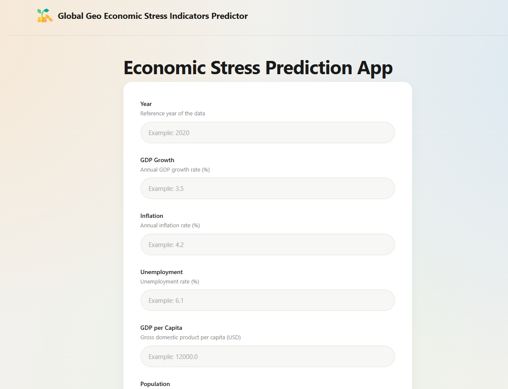

# Global-Geo-Economic-Stress-Indicators-Prediction
 
Predicting a country's economic stress score based on macroeconomic, demographic, and food-security indicators using a machine learning regression model.
 


## Problem Statement
 
Governments, NGOs, and economic researchers need a fast way to estimate a country's level of economic stress using publicly available indicators. This project trains a regression model on historical macroeconomic and food-security data to predict an economic stress score for a given country/year, then serves predictions through a FastAPI and a Django.

## Features Used
 
| Feature | Description |
|---|---|
| Year | Reference year of the data |
| GDP Growth | Annual GDP growth rate (%) |
| Inflation | Annual inflation rate (%) |
| Unemployment | Unemployment rate (%) |
| GDP per Capita | Gross domestic product per capita (USD) |
| Population | Total population |
| Food Production Index | Index value representing food production levels |
| Cereal Yield | Cereal yield (kg per hectare) |
| Cereal Production | Total cereal production (tonnes) |
| Agricultural Land % | Percentage of land area used for agriculture |
| Dietary Energy Supply Adequacy | Average dietary energy supply adequacy (%) |
| Data Completeness Score | Quality/completeness score of the underlying data (0–100) |
| Latitude | Geographic latitude of the country/region |
| Longitude | Geographic longitude of the country/region |
| Food Pressure Score | Computed food pressure score |
| Income Group | World Bank income classification (Low / Lower middle / Upper middle / High / Not classified) |

## Model Performance
 
| Metric    | Value                                      |
|-----------|--------------------------------------------|
| Algorithm | *(e.g. Random Forest Regressor / XGBoost)* |
| R2 Score  | *0.97*                                     |
| MAE       | *0.59*                                     |
| RMSE      | *0.45*                                     |

## Project Structure
 
```
Global-Geo-Economic-Stress-Indicators-Prediction/
├── api/
│   ├── app.py                        <-- (FastAPI main file)
│   ├── requirements.txt
│   └── Dockerfile
├── machine_learning/
│   ├── data/
│   │   ├── cleaned_data/
│   │   │   └── cleaned_merged_data.csv
│   │   ├── processed_data/
│   │   │   └── processed_merged_data.csv
│   │   └── raw_data/
│   │       ├── raw_country_metadata.csv
│   │       ├── raw_country_year_indicators.csv
│   │       └── raw_economic_stress_score.csv
│   ├── models/
│   │   └── model.pkl                 <-- (trained model)
│   ├── notebooks/
│   │   ├── EDA.ipynb
│   │   ├── Feature_Engineering.ipynb
│   │   └── Model_Training.ipynb
│   └── src/
├── web/
│   ├── web/                          <-- (Django project settings)
│   ├── main/                         <-- (main app: views, templates, static)
│   ├── manage.py
│   ├── requirements.txt
│   └── Dockerfile
├── .gitignore
├── docker-compose.yml
├── preview.png
└── README.md
```

## Tech Stack
 
- **ML:** Python, Pandas, Scikit-learn
- **API:** FastAPI, Uvicorn, Pydantic
- **Web:** Django, HTML, CSS, JavaScript
- **Infra:** Docker, Docker Compose

## Getting Started
 
### 1. Clone the repository
 
```bash
git clone https://github.com/<your-username>/Global-Geo-Economic-Stress-Indicators-Prediction.git
cd Global-Geo-Economic-Stress-Indicators-Prediction
```
 
### 2. Run with Docker
 
```bash
docker compose up --build
```
 
### 3. Open in browser
 
- **Web App:** [http://localhost:8000](http://localhost:8000)
- **API Docs:** [http://localhost:8001/docs](http://localhost:8001/docs)
## API Documentation
 
FastAPI auto-generates interactive docs:
 
[http://localhost:8001/docs](http://localhost:8001/docs)
 
## How to Use
 
1. Open [http://localhost:8000](http://localhost:8000) in your browser.
2. Fill in the country's indicators:
   - **Year** — reference year of the data
   - **GDP Growth** — annual growth rate (%)
   - **Inflation** — annual inflation rate (%)
   - **Unemployment** — unemployment rate (%)
   - **GDP per Capita** — in USD
   - **Population** — total population
   - **Food Production Index**, **Cereal Yield**, **Cereal Production**, **Agricultural Land %**, **Dietary Energy Supply Adequacy**, **Data Completeness Score**, **Latitude**, **Longitude**, **Food Pressure Score**
   - **Income Group** — select from the dropdown
3. Click **Predict**.
4. Get the predicted economic stress score, along with a short interpretation label.